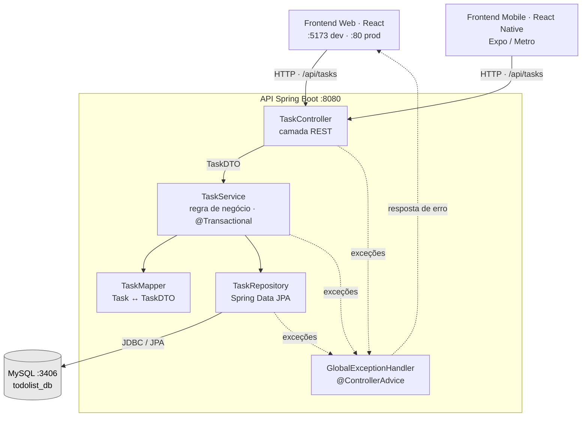
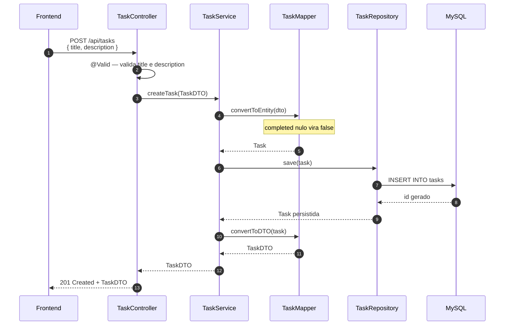
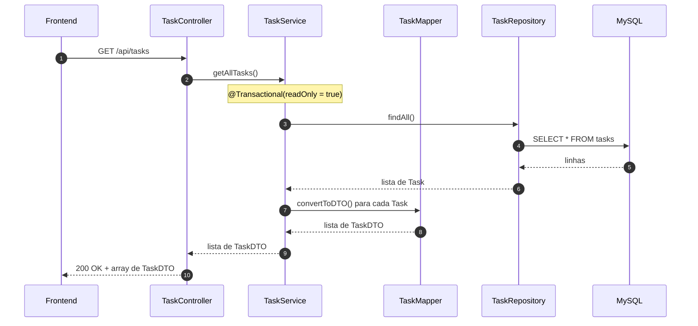
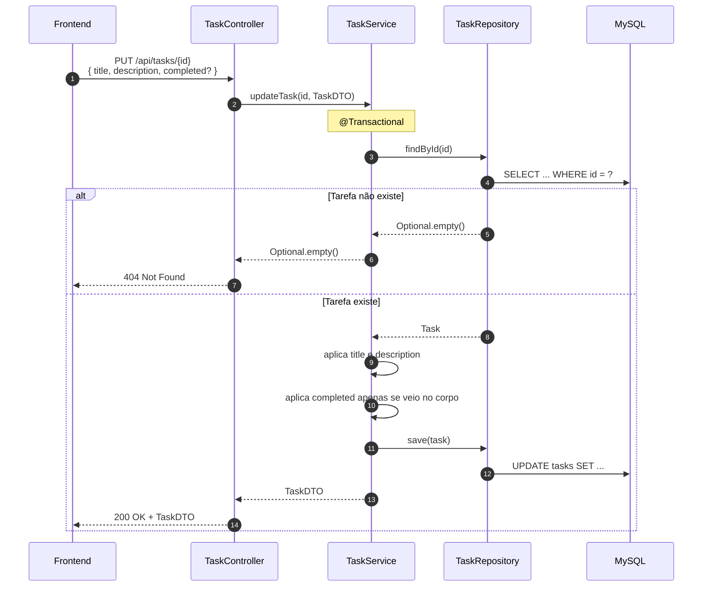
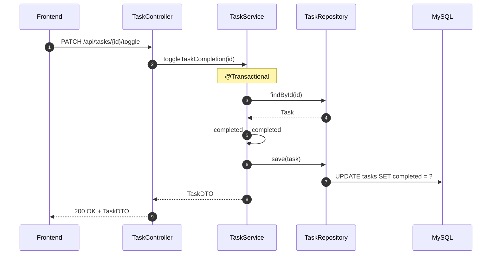
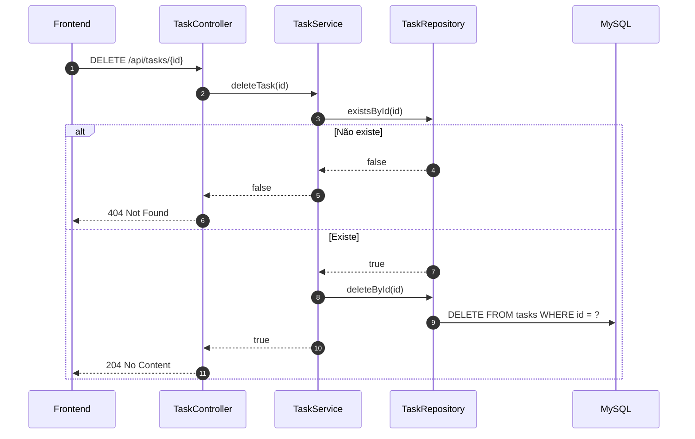
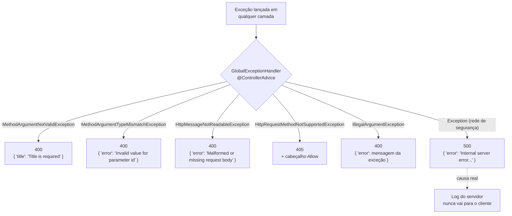

# TODO List - Arquitetura

## Visão Geral

Aplicação full-stack para gerenciamento de tarefas com:

- **Frontend Web** (React 19 + TypeScript + Vite)
- **Frontend Mobile** (React Native + Expo)
- **API REST** (Spring Boot 3.5.10 + Java 21)
- **Banco de Dados** (MySQL 8.0)

## Diagrama de Arquitetura



**Papel de cada peça:**

| Camada | Responsabilidade |
| ------ | ---------------- |
| `TaskController` | Recebe HTTP, delega e traduz o resultado em status code. Sem regra de negócio |
| `TaskService` | Regra de negócio e fronteira transacional. Retorna `Optional.empty()` para "não encontrado" |
| `TaskRepository` | Acesso a dados via Spring Data JPA |
| `TaskMapper` | Converte `Task` ↔ `TaskDTO`, impedindo que a estrutura da tabela vaze para a API |
| `TaskDTO` | Contrato público da API — o único tipo que cruza a fronteira HTTP |
| `Task` | Entidade JPA, visível apenas do service para baixo |
| `GlobalExceptionHandler` | Traduz exceções em respostas HTTP e impede vazamento de detalhes internos |

## Fluxo de Dados

### 1. Criar Tarefa



### 2. Listar Tarefas



### 3. Atualizar Tarefa



> **`completed` é opcional no `PUT`.** Omitir o campo preserva o estado atual da tarefa; enviá-lo
> sobrescreve. É o que permite ao frontend renomear uma tarefa concluída sem desmarcá-la — o
> `TaskFormData` de web e mobile envia apenas `title` e `description`.

### 4. Alternar Status (Toggle)



> **Por que `@Transactional` nas escritas**: `updateTask` e `toggleTaskCompletion` leem a tarefa e
> só depois gravam. Sem a transação envolvendo as duas operações, duas requisições simultâneas
> sobre a mesma tarefa poderiam sobrescrever uma à outra (*lost update*).

### 5. Deletar Tarefa



### 6. Caminho de Erro



## Containers Docker

| Serviço | Container | Porta | Descrição |
| ------- | --------- | ----- | --------- |
| Frontend Web | todolist_frontend_web | 80 | React + Vite (build) |
| Backend API | todolist_backend_api | 8080 | Spring Boot |
| Database | todolist_backend_db | 3406 | MySQL 8.0 |
| Test DB | todolist_backend_test_db | 3307 | MySQL (testes) |

Todos os containers na rede: `api_network`

## Inicialização Rápida

```bash
# Subir todos os serviços
docker-compose up -d

# Ver logs da API
docker logs -f todolist_backend_api

# Testar API
curl http://localhost:8080/api/tasks

# Parar serviços
docker-compose down
```

## Stack Técnico

| Camada | Tecnologia |
| ------ | ---------- |
| Backend | Java 21 + Spring Boot 3.5.10 |
| Banco de testes | H2 em memória (profile `test`) |
| Frontend Web | React 19 + TypeScript + Vite |
| Frontend Mobile | React Native 0.76.5 + Expo ~52.0 |
| Database | MySQL 8.0 |
| ORM | Spring Data JPA + Hibernate |
| Build (backend) | Maven 3.9 |
| Container | Docker + Docker Compose |

---

**Última atualização:** 29 de julho de 2026
