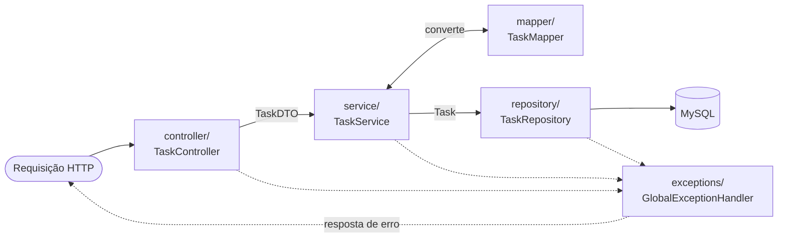

# API To-Do List - Backend

API REST do projeto de gerenciamento de tarefas desenvolvida com Spring Boot.

## Tecnologias Utilizadas

- **Java 21**: Linguagem de programação principal
- **Spring Boot 3.5.10**: Framework para criação de aplicações Java
- **Spring Data JPA**: Abstração para acesso a dados e persistência
- **MySQL**: Banco de dados relacional
- **Maven**: Gerenciador de dependências e build
- **Hibernate**: ORM para mapeamento objeto-relacional
- **SpringDoc OpenAPI 2.8.13**: Documentação automática da API (Swagger)
- **Bean Validation**: Validação de dados com anotações
- **Spring Boot Actuator**: Monitoramento e métricas
- **H2**: Banco em memória usado apenas pelos testes
- **JaCoCo 0.8.13**: Medição de cobertura de testes

## Como Começar

### Requisitos do Sistema

- Java 21 ou superior
- Maven 3.6 ou superior
- MySQL 8.0 ou superior (ou via Docker)
- Git para controle de versão

### Configuração do Banco de Dados

Edite `src/main/resources/application.properties` ou defina variáveis de ambiente:

```properties
# Data Source Configuration (MySQL)
spring.datasource.url=${SPRING_DATASOURCE_URL:jdbc:mysql://localhost:3406/todolist_db?allowPublicKeyRetrieval=true&useSSL=false}
spring.datasource.username=${SPRING_DATASOURCE_USERNAME:todolist_user}
spring.datasource.password=${SPRING_DATASOURCE_PASSWORD:todolist_password}
spring.datasource.driver-class-name=com.mysql.cj.jdbc.Driver

# JPA/Hibernate
spring.jpa.hibernate.ddl-auto=update
spring.jpa.show-sql=true
spring.jpa.properties.hibernate.format_sql=true
spring.jpa.properties.hibernate.dialect=org.hibernate.dialect.MySQLDialect
```

> **Nota**: Defina `SPRING_DATASOURCE_URL`, `SPRING_DATASOURCE_USERNAME` e `SPRING_DATASOURCE_PASSWORD` como variáveis de ambiente em produção.

## Comandos Principais

```bash
# Windows — iniciar servidor de desenvolvimento
./mvnw.cmd spring-boot:run

# Linux/Mac — iniciar servidor de desenvolvimento
./mvnw spring-boot:run

# Executar testes (não requer banco de dados — ver seção Testes)
./mvnw test

# Executar testes + verificação de cobertura mínima
./mvnw verify

# Gerar o Javadoc em HTML
./mvnw javadoc:javadoc

# Gerar o relatório HTML dos testes
./mvnw surefire-report:report

# Criar build para produção
./mvnw clean package

# Executar o JAR gerado
java -jar target/todolist-api-1.0.0-RELEASE.jar
```

O servidor ficará disponível em `http://localhost:8080`.

### Onde acessar cada coisa

| O que | Onde | Precisa da aplicação rodando? |
| ----- | ---- | ----------------------------- |
| **Swagger UI** — explorar e testar endpoints | <http://localhost:8080/swagger-ui/index.html> | Sim |
| **OpenAPI JSON** | <http://localhost:8080/v3/api-docs> | Sim |
| **Javadoc** | `target/reports/apidocs/index.html` | Não |
| **Relatório de testes** | `target/reports/surefire.html` | Não |
| **Cobertura de testes** | `target/site/jacoco/index.html` | Não |
| **Health check** | <http://localhost:8080/actuator/health> | Sim |

Os três arquivos locais são HTML estático: basta abrir no navegador. As seções
[Documentação da API](#documentação-da-api), [Javadoc](#javadoc) e a
[TESTS.md](TESTS.md#relatórios-html) detalham cada um.

## Arquitetura da API

### Estrutura em Camadas

```plaintext
src/main/java/com/todolist/api/
├── controller/       # Camada de apresentação (REST endpoints)
├── service/          # Camada de lógica de negócio
├── repository/       # Camada de acesso a dados
├── model/            # Entidades do banco de dados
├── dto/              # Data Transfer Objects
├── mapper/           # Conversão entre Entity e DTO
├── exceptions/       # Tratamento global de erros
└── config/           # Configurações (CORS, OpenAPI)
```

O caminho de uma requisição pelas camadas:



A regra que sustenta essa separação: **`TaskDTO` nunca desce abaixo do service, e `Task` nunca
sobe acima dele**. O `TaskMapper` é a única fronteira entre os dois.

### Endpoints da API

| Método | Endpoint | Descrição |
| -------- | ---------- | ----------- |
| `GET` | `/api/tasks` | Lista todas as tarefas |
| `GET` | `/api/tasks/{id}` | Busca uma tarefa por ID |
| `POST` | `/api/tasks` | Cria uma nova tarefa |
| `PUT` | `/api/tasks/{id}` | Atualiza título, descrição e, se informado, o status |
| `PATCH` | `/api/tasks/{id}/toggle` | Alterna o status de conclusão |
| `DELETE` | `/api/tasks/{id}` | Remove uma tarefa |

### Modelo de Dados

A entidade `Task` possui os seguintes campos:

```json
{
  "id": 1,
  "title": "Estudar Spring Boot",
  "description": "Completar o tutorial de Spring Boot",
  "completed": false
}
```

**Validações:**

- `title`: Obrigatório, máximo 100 caracteres
- `description`: Opcional, máximo 500 caracteres
- `completed`: Booleano opcional, valor padrão `false`

> **Sobre `completed` em requisições `PUT`**: o campo é opcional. Se for **omitido**, o estado
> atual da tarefa é preservado; se for **enviado**, o valor recebido sobrescreve o atual.
> Ou seja, renomear uma tarefa já concluída sem reenviar `completed` não a marca como pendente.

## Guia de Implementação

### 1. Model (Entidade)

A classe `Task.java` representa a entidade no banco de dados:

```java
@Entity
@Table(name = "tasks")
public class Task {
    @Id
    @GeneratedValue(strategy = GenerationType.IDENTITY)
    private Long id;

    @Column(nullable = false, length = 100)
    private String title;

    @Column(length = 500)
    private String description;

    @Column(nullable = false)
    private boolean completed;

    public Task() {
        this.title = "";
        this.completed = false;
    }

    public Task(String title, String description) {
        this.title = title;
        this.description = description;
        this.completed = false;
    }
    // getters e setters...
}
```

> **Importante**: os `length` das colunas espelham os limites de `@Size` do `TaskDTO`. Sem isso,
> as colunas seriam criadas com o padrão de 255 caracteres e uma descrição de 300 caracteres —
> aprovada pela validação da API — seria rejeitada pelo banco no `INSERT`, resultando em
> **500 Internal Server Error**.

### 2. DTO (Data Transfer Object)

O `TaskDTO.java` é usado para transferência de dados entre camadas:

```java
@Schema(description = "Representação de uma tarefa")
public class TaskDTO {
    @Schema(description = "Identificador da tarefa, atribuído pelo servidor", example = "1",
            accessMode = Schema.AccessMode.READ_ONLY)
    private Long id;

    @NotBlank(message = "Title is required")
    @Size(max = 100, message = "Title must be less than 100 characters")
    @Schema(description = "Título da tarefa", example = "Estudar Spring Boot", maxLength = 100,
            requiredMode = Schema.RequiredMode.REQUIRED)
    private String title;

    @Size(max = 500, message = "Description must be less than 500 characters")
    @Schema(description = "Descrição detalhada da tarefa", maxLength = 500)
    private String description;

    @Schema(description = "Estado de conclusão. Se omitido em um PUT, o estado atual é preservado",
            example = "false")
    private Boolean completed;

    public TaskDTO() {
        this.title = "";
        this.completed = false;
    }

    public TaskDTO(Long id, String title, String description, Boolean completed) {
        this.id = id;
        this.title = title;
        this.description = description;
        this.completed = completed;
    }
    // getters e setters...
}
```

> **Por que `Boolean` e não `boolean`?** Um primitivo não distingue "campo não enviado" de
> "enviado como `false`" — o Jackson preenche ambos com `false`. Com `Boolean`, o valor `null`
> significa "não informado" e permite ao service preservar o estado atual da tarefa em um `PUT`
> parcial. As anotações `@Schema` alimentam a documentação exibida no Swagger UI.

### 3. Repository

Interface que estende `JpaRepository` para acesso a dados:

```java
@Repository
public interface TaskRepository extends JpaRepository<Task, Long> {
    // Métodos customizados podem ser adicionados aqui
}
```

### 4. Service

Camada de lógica de negócio:

```java
@Service
public class TaskService {
    // @Transactional(readOnly = true)
    // getAllTasks(): Retorna todas as tarefas como lista de DTOs
    // getTaskById(Long id): Busca tarefa por ID, retorna Optional<TaskDTO>

    // @Transactional
    // createTask(TaskDTO): Cria nova tarefa
    // updateTask(Long id, TaskDTO): Atualiza tarefa existente, retorna Optional<TaskDTO>
    // deleteTask(Long id): Remove tarefa, retorna boolean
    // toggleTaskCompletion(Long id): Alterna status, retorna Optional<TaskDTO>
}
```

**Convenções da camada:**

- **"Não encontrado" é `Optional.empty()`**, não exceção. O controller traduz isso em 404.
- **Escritas são transacionais.** `updateTask` e `toggleTaskCompletion` fazem leitura seguida de
  escrita; sem `@Transactional` as duas operações rodariam em transações separadas, abrindo
  janela para que requisições concorrentes sobrescrevessem uma à outra (*lost update*).
- **Leituras usam `readOnly = true`**, o que dispensa o Hibernate de rastrear alterações.

### 5. Controller

Camada REST que expõe os endpoints:

```java
@RestController
@RequestMapping("/api/tasks")
@Tag(name = "Tasks", description = "Task management API")
public class TaskController {
    // Endpoints mapeados com @GetMapping, @PostMapping, @PutMapping, @PatchMapping, @DeleteMapping
}
```

### 6. Mapper

Converte entre `Task` (Entity) e `TaskDTO`:

```java
@Component
public class TaskMapper {
    public TaskDTO convertToDTO(Task task) { ... }
    public Task convertToEntity(TaskDTO taskDTO) { ... }
}
```

### 7. Exception Handler

Trata erros globalmente:

```java
@ControllerAdvice
public class GlobalExceptionHandler {

    // Trata erros de validação (@Valid) — retorna campo → mensagem
    @ExceptionHandler(MethodArgumentNotValidException.class)
    public ResponseEntity<Map<String, String>> handleValidationErrors(...) { ... }

    // Trata parâmetro de URL com tipo errado, ex.: GET /api/tasks/abc
    @ExceptionHandler(MethodArgumentTypeMismatchException.class)
    public ResponseEntity<Map<String, String>> handleTypeMismatch(...) { ... }

    // Trata corpo ilegível: JSON malformado ou ausente
    @ExceptionHandler(HttpMessageNotReadableException.class)
    public ResponseEntity<Map<String, String>> handleUnreadableBody(...) { ... }

    // Trata método HTTP não suportado pelo endpoint
    @ExceptionHandler(HttpRequestMethodNotSupportedException.class)
    public ResponseEntity<Map<String, String>> handleMethodNotSupported(...) { ... }

    // Trata argumentos inválidos
    @ExceptionHandler(IllegalArgumentException.class)
    public ResponseEntity<Map<String, String>> handleIllegalArgument(...) { ... }

    // Trata exceções genéricas
    @ExceptionHandler(Exception.class)
    public ResponseEntity<Map<String, String>> handleGenericError(...) { ... }
}
```

**Respostas de erro:**

- **400 Bad Request** — Validação: `{ "title": "Title is required" }`
- **400 Bad Request** — Parâmetro inválido: `{ "error": "Invalid value for parameter 'id'" }`
- **400 Bad Request** — Corpo ilegível: `{ "error": "Malformed or missing request body" }`
- **400 Bad Request** — Argumento inválido: `{ "error": "Invalid request" }`
- **404 Not Found** — Recurso não encontrado: **sem corpo**
- **405 Method Not Allowed** — Método não suportado: `{ "error": "Method PATCH is not supported for this endpoint" }`, acompanhado do cabeçalho `Allow`
- **500 Internal Server Error** — Erro genérico: `{ "error": "Internal server error. Please try again." }`

> **Nota**: erros de validação respondem com um mapa **campo → mensagem** (para o frontend
> destacar cada campo), enquanto os demais respondem com `{ "error": "..." }`. Os 404 vêm
> diretamente do controller e não têm corpo. Unificar esses três formatos em
> [RFC 7807 `ProblemDetail`](https://www.rfc-editor.org/rfc/rfc7807) é uma melhoria pendente.
>
> **Por que os handlers de tipo e de corpo ilegível existem**: sem eles, `GET /api/tasks/abc` e
> um JSON malformado cairiam no handler genérico de `Exception` e retornariam **500**, culpando
> o servidor por um erro que é do cliente.

## Documentação da API

### Swagger UI — explorar e testar os endpoints

Com a aplicação rodando (`./mvnw spring-boot:run` ou `docker-compose up -d`), abra no navegador:

| Recurso | URL |
| ------- | --- |
| **Swagger UI** (interface interativa) | <http://localhost:8080/swagger-ui/index.html> |
| **OpenAPI JSON** (documento bruto) | <http://localhost:8080/v3/api-docs> |

O Swagger UI não serve só para ler: é possível **executar requisições reais** contra a API direto
do navegador, sem Postman nem `curl`.

**Como testar um endpoint pelo Swagger UI:**

1. Abra <http://localhost:8080/swagger-ui/index.html>
2. Clique na seção **Tasks** para expandir os endpoints
3. Clique no endpoint desejado, por exemplo `POST /api/tasks`
4. Clique em **Try it out** — o corpo de exemplo vira editável
5. Ajuste o JSON (os exemplos de cada campo vêm das anotações `@Schema` do `TaskDTO`)
6. Clique em **Execute**
7. Role até **Server response** para ver o status HTTP, o corpo e os headers da resposta real

A seção **Schemas**, no rodapé da página, mostra a estrutura do `TaskDTO` com a descrição, o
exemplo e as restrições de cada campo. Cada endpoint também lista os possíveis erros
(400, 404, 405, 500) com o formato do corpo de cada um.

> **Atenção**: o "Try it out" grava no banco de verdade. Em ambiente com dados que importam, use
> o Swagger apenas para leitura, ou aponte a aplicação para uma base descartável.

### Configuração

O SpringDoc descobre os endpoints automaticamente a partir das anotações dos controllers. Os
metadados globais (título, descrição, versão, licença) vêm de `OpenApiConfig.java`:

O SpringDoc descobre os endpoints automaticamente a partir das anotações dos controllers. Os
metadados globais (título, descrição, versão, licença) vêm de `OpenApiConfig.java`:

```java
@Configuration
public class OpenApiConfig {
    @Bean
    OpenAPI todolistOpenAPI() {
        return new OpenAPI().info(new Info()
                .title("To-Do List API")
                .description("API REST para gerenciamento de tarefas...")
                .version(applicationVersion)   // lida do pom.xml
                .contact(...)
                .license(new License().name("MIT License")));
    }
}
```

Cada endpoint documenta também os formatos de erro que pode retornar, via `@ApiResponse` com
`@Content` e `@Schema`, e cada campo do `TaskDTO` traz descrição e exemplo via `@Schema`.

> A versão do SpringDoc precisa acompanhar a linha do Spring Boot. A série 2.5.x é incompatível
> com o Spring Framework 6.2 (usado pelo Boot 3.5) e faz `/v3/api-docs` retornar **500** com
> `NoSuchMethodError: ControllerAdviceBean`. O `OpenApiDocsTest` existe justamente para
> transformar esse tipo de quebra em falha de build, em vez de só aparecer no navegador.

## Javadoc

O Javadoc das classes é gerado em HTML navegável e lido no navegador — não é preciso abrir o
código-fonte para consultar o contrato de cada classe.

```bash
# Gerar o Javadoc
./mvnw javadoc:javadoc
```

A saída fica em **`target/reports/apidocs/index.html`**. Para abrir:

```bash
# Windows
start target/reports/apidocs/index.html

# macOS
open target/reports/apidocs/index.html

# Linux
xdg-open target/reports/apidocs/index.html
```

**Servindo em `localhost`** (útil para consultar de outra máquina da rede):

```bash
cd target/reports/apidocs && python -m http.server 8000
# depois acesse http://localhost:8000
```

O que você encontra lá: a lista de pacotes (`controller`, `service`, `repository`, `model`, `dto`,
`mapper`, `exceptions`, `config`), o contrato de cada método público, e a busca no canto superior
direito, que filtra classes e métodos conforme você digita.

**Publicar de fato online** (opcional): como o Javadoc é HTML estático, basta versionar o
conteúdo de `target/reports/apidocs/` em uma branch `gh-pages` para servi-lo pelo GitHub Pages,
em `https://<usuario>.github.io/<repositorio>/`.

> **Configuração**: o `maven-javadoc-plugin` está no `pom.xml` com `doclint` desligado e encoding
> UTF-8. O doclint é desligado porque a documentação do projeto é descritiva e não usa
> `@param`/`@return` em todo método — com a verificação padrão do JDK 21, a geração falharia.

## Configuração CORS

O CORS está configurado em `CorsConfig.java` para aceitar requisições dos frontends:

```java
@Configuration
public class CorsConfig {
    @Bean
    WebMvcConfigurer corsConfigurer() {
        return new WebMvcConfigurer() {
            @Override
            public void addCorsMappings(@NonNull CorsRegistry registry) {
                registry.addMapping("/api/**")
                        .allowedOrigins(
                            "http://localhost:3000",
                            "http://localhost:5173",
                            "http://127.0.0.1:5173"
                        )
                        .allowedMethods("GET", "POST", "PUT", "PATCH", "DELETE", "OPTIONS")
                        .allowedHeaders("Content-Type", "Authorization", "Accept")
                        .allowCredentials(true)
                        .maxAge(3600);
            }
        };
    }
}
```

## Executando com Docker

```bash
# Iniciar todos os serviços (MySQL + Backend)
docker-compose up -d

# Ver logs
docker-compose logs -f backend

# Parar os serviços
docker-compose down
```

## Testes

Os testes **não dependem de banco de dados**: as classes que sobem o contexto do Spring usam
`@ActiveProfiles("test")`, que ativa o H2 em memória configurado em
`src/test/resources/application-test.properties`. Não é preciso subir o Docker para rodá-los.

```bash
# Executar todos os testes (gera o relatório de cobertura em target/site/jacoco/)
./mvnw test

# Executar os testes e reprovar o build se a cobertura ficar abaixo do mínimo
./mvnw verify
```

O relatório de cobertura fica em `target/site/jacoco/index.html`. A cobertura mínima exigida
por `mvn verify` é definida pela propriedade `jacoco.coverage.minimum` no `pom.xml` (80%).

Detalhes sobre a estrutura e os tipos de teste estão em [TESTS.md](TESTS.md).

## Tratamento de Erros HTTP

| Código | Significado |
| -------- | ------------- |
| 200 OK | Operação bem-sucedida |
| 201 Created | Recurso criado com sucesso |
| 204 No Content | Recurso deletado com sucesso |
| 400 Bad Request | Dados inválidos na requisição |
| 404 Not Found | Recurso não encontrado |
| 405 Method Not Allowed | Método HTTP não suportado pelo endpoint |
| 500 Internal Server Error | Erro interno do servidor |

## Exemplo de Uso

### Criar uma nova tarefa

```bash
curl -X POST http://localhost:8080/api/tasks \
  -H "Content-Type: application/json" \
  -d '{"title": "Estudar Spring Boot", "description": "Completar o tutorial", "completed": false}'
```

### Listar todas as tarefas

```bash
curl http://localhost:8080/api/tasks
```

### Atualizar uma tarefa

```bash
# Omitindo 'completed', o estado de conclusão atual da tarefa é preservado
curl -X PUT http://localhost:8080/api/tasks/1 \
  -H "Content-Type: application/json" \
  -d '{"title": "Estudar Spring Boot - Atualizado", "description": "Completar o tutorial avançado"}'

# Informando 'completed', o valor enviado sobrescreve o atual
curl -X PUT http://localhost:8080/api/tasks/1 \
  -H "Content-Type: application/json" \
  -d '{"title": "Estudar Spring Boot", "description": "Tutorial concluído", "completed": true}'
```

### Alternar status de conclusão

```bash
curl -X PATCH http://localhost:8080/api/tasks/1/toggle
```

### Deletar uma tarefa

```bash
curl -X DELETE http://localhost:8080/api/tasks/1
```

---

**Última atualização:** 29 de julho de 2026
