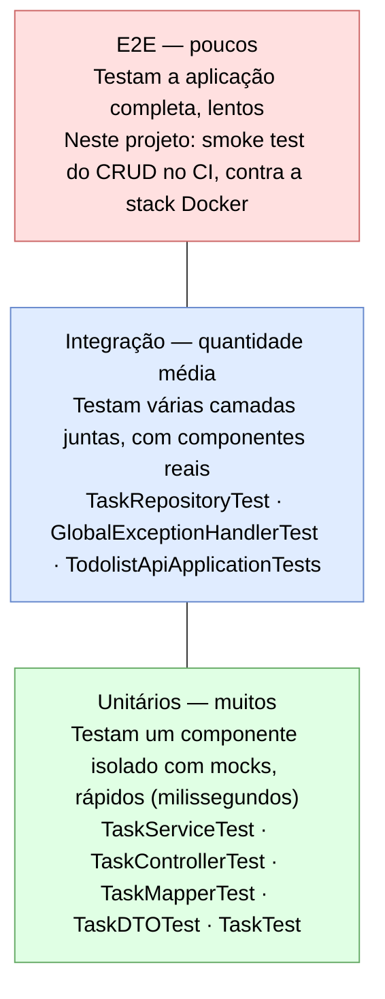

# Guia de Testes - Aplicação To Do List

## Objetivo deste Guia

Este documento explica a estrutura de testes da aplicação To Do List, servindo como material didático para ensinar conceitos de testes unitários e de integração em Spring Boot.

---

## Índice

1. [Conceitos Fundamentais](#conceitos-fundamentais)
2. [Estrutura de Testes](#estrutura-de-testes)
3. [Tipos de Testes](#tipos-de-testes)
4. [Anotações Importantes](#anotações-importantes)
5. [Mockito - Framework de Mocks](#mockito---framework-de-mocks)
6. [Como Executar os Testes](#como-executar-os-testes)

---

## Conceitos Fundamentais

### O que são Testes Automatizados?

Testes automatizados são códigos que verificam se o código de produção funciona corretamente. Eles trazem diversos benefícios:

- Previnem bugs antes que cheguem à produção
- Facilitam refatoração do código com segurança
- Documentam o comportamento esperado do sistema
- Aumentam a confiança ao fazer mudanças

### Pirâmide de Testes

A ideia da pirâmide é ter muitos testes rápidos e baratos na base, e poucos testes lentos e caros
no topo:



Nossa aplicação foca em **testes unitários** e **testes de integração**.

---

## Estrutura de Testes

```plaintext
src/test/java/com/todolist/api/
├── controller/
│   └── TaskControllerTest.java          # Testa endpoints HTTP (caminho feliz)
├── service/
│   └── TaskServiceTest.java             # Testa lógica de negócio
├── repository/
│   └── TaskRepositoryTest.java          # Testa acesso ao banco
├── exceptions/
│   └── GlobalExceptionHandlerTest.java  # Testa os caminhos de erro da API
├── config/
│   └── OpenApiDocsTest.java             # Testa a documentação OpenAPI/Swagger
├── mapper/
│   └── TaskMapperTest.java              # Testa conversões Entity↔DTO
├── model/
│   └── TaskTest.java                    # Testa entidade
└── dto/
    └── TaskDTOTest.java                 # Testa DTO

src/test/resources/
└── application-test.properties          # Configuração do profile 'test' (H2 em memória)
```

### Banco de dados nos testes

Os testes **não dependem de MySQL nem de Docker**. As classes que sobem o contexto do Spring
(`TaskRepositoryTest` e `TodolistApiApplicationTests`) são anotadas com `@ActiveProfiles("test")`,
que ativa `src/test/resources/application-test.properties` e aponta o datasource para um **H2 em
memória**, recriado a cada execução:

```properties
spring.datasource.url=jdbc:h2:mem:todolist_test;DB_CLOSE_DELAY=-1;MODE=MySQL
spring.jpa.hibernate.ddl-auto=create-drop
```

`MODE=MySQL` faz o H2 aceitar a sintaxe do MySQL, mantendo os testes fiéis ao banco de produção.

> Sem esse profile, os testes herdariam o datasource de `src/main/resources/application.properties`
> e tentariam se conectar ao MySQL de desenvolvimento em `localhost:3406` — o que faz a suíte
> falhar quando o Docker não está no ar e, quando está, faz os testes escreverem no banco de
> desenvolvimento.

### Espelhamento da Estrutura

A estrutura de testes **espelha** a estrutura do código de produção:

- `src/main/java/...` → Código de produção
- `src/test/java/...` → Código de testes

---

## Tipos de Testes

### 1. Testes Unitários

**Objetivo:** Testar um único componente isoladamente

**Características:**

- Rápidos (milissegundos)
- Isolados (usam mocks)
- Não acessam banco de dados real
- Não fazem requisições HTTP reais

**Exemplos na aplicação:**

- `TaskServiceTest` — testa lógica de negócio
- `TaskMapperTest` — testa conversões
- `TaskDTOTest` e `TaskTest` — testam objetos de transferência e a entidade

### 2. Testes de Integração

**Objetivo:** Testar integração entre componentes

**Características:**

- Mais lentos que unitários
- Usam componentes reais
- Podem usar banco H2 em memória
- Testam fluxo completo

**Exemplos na aplicação:**

- `TaskRepositoryTest` — testa contra um banco H2 real em memória
- `TaskControllerTest` — testa requisições HTTP simuladas via `MockMvc`
- `GlobalExceptionHandlerTest` — testa os caminhos de erro da API de ponta a ponta
- `TodolistApiApplicationTests` — teste de fumaça: sobe o contexto completo do Spring
- `OpenApiDocsTest` — sobe um servidor HTTP real e verifica a documentação OpenAPI

---

## Anotações Importantes

### Anotações de Teste (JUnit 5)

| Anotação | Uso | Exemplo |
| -------- | --- | ------- |
| `@Test` | Marca um método como teste | `@Test void testSomething()` |
| `@BeforeEach` | Executa antes de cada teste | `@BeforeEach void setUp()` |
| `@AfterEach` | Executa depois de cada teste | `@AfterEach void tearDown()` |
| `@DisplayName` | Nome legível do teste | `@DisplayName("Deve criar tarefa")` |

### Anotações do Mockito

| Anotação | Uso | Exemplo |
| -------- | --- | ------- |
| `@ExtendWith(MockitoExtension.class)` | Habilita Mockito | Na classe de teste |
| `@Mock` | Cria um mock (objeto simulado) | `@Mock TaskRepository repo` |
| `@InjectMocks` | Injeta mocks na classe testada | `@InjectMocks TaskService service` |

### Anotações do Spring Boot

| Anotação | Uso | Quando usar |
| -------- | --- | ----------- |
| `@DataJpaTest` | Testa repositories | `TaskRepositoryTest` |
| `@ActiveProfiles("test")` | Ativa o profile de teste (H2) | Toda classe que sobe o contexto Spring |
| `@AutoConfigureTestDatabase(replace = NONE)` | Impede a troca automática do datasource | `TaskRepositoryTest`, para usar o H2 do profile |
| `@WebMvcTest` | Testa controllers | Alternativa ao MockMvc standalone |
| `@SpringBootTest` | Carrega contexto completo | `TodolistApiApplicationTests` |

---

## Padrão AAA (Arrange-Act-Assert)

Todos os testes seguem este padrão:

```java
@Test
void testExample() {
    // ARRANGE (Preparar)
    TaskDTO taskDTO = new TaskDTO(1L, "Teste", "Descrição", false);
    when(repository.findById(1L)).thenReturn(Optional.of(task));
    
    // ACT (Agir)
    Optional<TaskDTO> result = service.getTaskById(1L);
    
    // ASSERT (Verificar)
    assertTrue(result.isPresent());
    assertEquals("Teste", result.get().getTitle());
    verify(repository, times(1)).findById(1L);
}
```

### Explicação de cada fase

1. **ARRANGE**: Prepara tudo que o teste precisa — cria objetos, configura mocks, define comportamentos esperados
2. **ACT**: Executa a ação sendo testada — deve ser **uma única linha** idealmente
3. **ASSERT**: Verifica os resultados com assertions e verifica chamadas de métodos

---

## Mockito - Framework de Mocks

### O que é um Mock?

Um **mock** é uma versão simulada de um objeto real. Usamos mocks para isolar o código sendo testado, simular comportamentos e verificar interações.

### Principais Métodos do Mockito

#### `when().thenReturn()`

```java
when(repository.findById(1L)).thenReturn(Optional.of(task));
```

#### `verify()`

```java
verify(repository, times(1)).findById(1L);
verify(repository, never()).deleteById(any());
```

#### `any()` e `eq()`

```java
when(service.createTask(any(TaskDTO.class))).thenReturn(taskDTO);
when(service.updateTask(eq(1L), any(TaskDTO.class))).thenReturn(Optional.of(taskDTO));
```

### Exemplo Completo

```java
@ExtendWith(MockitoExtension.class)
class TaskServiceTest {
    
    @Mock
    private TaskRepository taskRepository;
    
    @Mock
    private TaskMapper taskMapper;
    
    @InjectMocks
    private TaskService taskService;
    
    @Test
    void testGetTaskById() {
        // ARRANGE
        Task task = new Task("Teste", "Descrição");
        TaskDTO dto = new TaskDTO(1L, "Teste", "Descrição", false);
        when(taskRepository.findById(1L)).thenReturn(Optional.of(task));
        when(taskMapper.convertToDTO(task)).thenReturn(dto);
        
        // ACT
        Optional<TaskDTO> result = taskService.getTaskById(1L);
        
        // ASSERT
        assertTrue(result.isPresent());
        assertEquals("Teste", result.get().getTitle());
        verify(taskRepository, times(1)).findById(1L);
    }
}
```

---

## Assertions Comuns

```java
// Igualdade
assertEquals(esperado, real);
assertEquals(1L, task.getId());

// Verdadeiro/Falso
assertTrue(condition);
assertFalse(condition);

// Nulo/Não-nulo
assertNull(object);
assertNotNull(object);

// Coleções
assertEquals(3, lista.size());

// Exceções
assertThrows(ExceptionType.class, () -> metodo());
```

---

## Testes por Camada

### 1. Controller Tests (`TaskControllerTest`)

**O que testa:** Endpoints HTTP, status codes, formato JSON, validações de entrada

**Ferramentas:** `MockMvc`, `@Mock TaskService`, `ObjectMapper`

```java
@ExtendWith(MockitoExtension.class)
class TaskControllerTest {
    private MockMvc mockMvc;

    @Mock
    private TaskService taskService;

    @InjectMocks
    private TaskController taskController;

    @BeforeEach
    void setUp() {
        mockMvc = MockMvcBuilders.standaloneSetup(taskController).build();
    }

    @Test
    void testGetAllTasks() throws Exception {
        when(taskService.getAllTasks()).thenReturn(Arrays.asList(taskDTO));

        mockMvc.perform(get("/api/tasks"))
                .andExpect(status().isOk())
                .andExpect(jsonPath("$[0].title").value("Test Task"))
                .andExpect(jsonPath("$[0].completed").value(false));

        verify(taskService, times(1)).getAllTasks();
    }
}
```

### 2. Service Tests (`TaskServiceTest`)

**O que testa:** Lógica de negócio, interação com Repository e Mapper, tratamento de Optional

**Ferramentas:** `@Mock TaskRepository`, `@Mock TaskMapper`, `@InjectMocks TaskService`

```java
when(taskRepository.findById(1L)).thenReturn(Optional.of(task));
when(taskMapper.convertToDTO(task)).thenReturn(dto);
Optional<TaskDTO> result = taskService.getTaskById(1L);
verify(taskRepository, times(1)).findById(1L);
```

### 3. Repository Tests (`TaskRepositoryTest`)

**O que testa:** Operações CRUD no banco, queries, integridade dos dados

**Ferramentas:** `@DataJpaTest` + `@ActiveProfiles("test")` (banco H2 em memória),
`@Autowired TaskRepository`

```java
Task savedTask = taskRepository.save(task);
assertNotNull(savedTask.getId());
```

Inclui também um **teste de regressão** que persiste uma descrição de 500 caracteres, garantindo
que a coluna do banco comporta o tamanho máximo aceito pela validação do `TaskDTO`.

### 3.1. Exception Handler Tests (`GlobalExceptionHandlerTest`)

**O que testa:** Os caminhos de erro da API — qual status HTTP e qual corpo o cliente recebe
quando algo dá errado.

**Ferramentas:** `MockMvc` com `setControllerAdvice()`, `@Mock TaskService`

```java
mockMvc = MockMvcBuilders.standaloneSetup(taskController)
        .setControllerAdvice(new GlobalExceptionHandler())
        .build();
```

> `setControllerAdvice()` é obrigatório: sem ele o MockMvc standalone ignora o
> `@ControllerAdvice` e usa o tratamento padrão do Spring — os testes estariam verificando um
> comportamento diferente do da aplicação real.

Cenários cobertos: validação de campo (400), id não numérico (400), JSON malformado (400),
corpo ausente (400), método não suportado (405), exceção inesperada (500 genérico, sem vazar a
mensagem original) e o caminho feliz, para garantir que o handler não interfere nele.

### 3.2. OpenAPI Tests (`OpenApiDocsTest`)

**O que testa:** Que a documentação interativa sobe e descreve a API corretamente.

**Ferramentas:** `@SpringBootTest(webEnvironment = RANDOM_PORT)`, `TestRestTemplate`

```java
ResponseEntity<String> response = restTemplate.getForEntity("/v3/api-docs", String.class);
assertEquals(HttpStatus.OK, response.getStatusCode());
assertTrue(response.getBody().contains("To-Do List API"));
```

**Por que testar documentação?** Porque ela é gerada em tempo de execução pelo SpringDoc a partir
das anotações dos controllers — nada disso é verificado em tempo de compilação. Uma versão
incompatível do SpringDoc ou uma anotação malformada só apareceria ao abrir o Swagger UI no
navegador. Este teste transforma esse tipo de quebra em falha de build.

> Não é hipotético: foi exatamente este teste que revelou que o SpringDoc 2.5.0 é incompatível
> com o Spring Framework 6.2 e fazia `/v3/api-docs` retornar 500.

### 4. Mapper Tests (`TaskMapperTest`)

**O que testa:** Conversão `Entity → DTO` e `DTO → Entity`, preservação de dados

```java
TaskMapper mapper = new TaskMapper();
TaskDTO dto = mapper.convertToDTO(task);
assertEquals(task.getTitle(), dto.getTitle());
```

### 5. DTO/Model Tests

**O que testa:** Construtores, getters/setters, valores padrão

```java
TaskDTO dto = new TaskDTO();
assertEquals("", dto.getTitle());
assertFalse(dto.getCompleted());
```

---

## Como Executar os Testes

### Pelo Maven (linha de comando)

Nenhum comando abaixo exige banco de dados ou Docker — os testes usam H2 em memória.

```bash
# Executar todos os testes (já gera o relatório de cobertura)
./mvnw test

# Executar testes de uma classe específica
./mvnw test -Dtest=TaskControllerTest

# Executar um teste específico
./mvnw test -Dtest=TaskControllerTest#testGetAllTasks

# Executar os testes e reprovar o build se a cobertura ficar abaixo do mínimo
./mvnw verify
```

## Relatórios HTML

A saída do terminal mostra apenas o resumo. Para navegar pelos resultados classe a classe, teste
a teste, o projeto gera dois relatórios em HTML.

### Relatório de execução dos testes

```bash
# Roda os testes e gera o relatório
./mvnw surefire-report:report

# Apenas gera o HTML a partir da última execução (não roda os testes de novo)
./mvnw surefire-report:report-only
```

Saída: **`target/reports/surefire.html`**

Mostra o total de testes, falhas, erros e tempo, o detalhamento por classe com o tempo de cada
método, e a stack trace completa de cada teste que falhou — bem mais legível que o XML bruto em
`target/surefire-reports/`.

### Relatório de cobertura

```bash
# Gerado automaticamente por 'mvn test'
./mvnw test
```

Saída: **`target/site/jacoco/index.html`**

Mostra a cobertura por pacote e por classe. Ao clicar em uma classe, o código-fonte aparece
anotado: **verde** para linhas executadas pelos testes, **vermelho** para linhas nunca executadas
e **amarelo** para condicionais só parcialmente testadas (por exemplo, um `if` em que apenas o
ramo verdadeiro foi exercitado).

### Abrindo os relatórios

```bash
# Windows
start target/reports/surefire.html
start target/site/jacoco/index.html

# macOS
open target/reports/surefire.html

# Linux
xdg-open target/reports/surefire.html
```

> No CI, os relatórios são publicados como artefatos do workflow — `test-results`,
> `coverage-report` e `javadoc` — e podem ser baixados na página da execução no GitHub Actions,
> sem precisar rodar nada localmente.

### Pelo IDE (VS Code, IntelliJ)

1. **Todos os testes**: clique direito na pasta `test` → "Run Tests"
2. **Por classe**: clique direito no arquivo `...Test.java` → "Run Tests"
3. **Por método**: clique no ícone `>` ao lado do método `@Test`

---

## Cobertura de Testes

Cobertura mede quantas linhas/métodos do código foram executados pelos testes. O projeto usa
**JaCoCo**, configurado no `pom.xml`.

| Tipo | Descrição |
| ---- | --------- |
| Line Coverage | % de linhas executadas |
| Branch Coverage | % de condicionais (if/else) testadas |
| Method Coverage | % de métodos executados |

### Como funciona no projeto

- `./mvnw test` gera o relatório HTML em **`target/site/jacoco/index.html`**
- `./mvnw verify` além disso **reprova o build** se a cobertura de linhas ficar abaixo do mínimo
- O mínimo é a propriedade `jacoco.coverage.minimum` no `pom.xml` (atualmente **80%**)
- Ficam fora da medição as classes sem lógica de negócio: `TodolistApiApplication` e o pacote
  `config/`

No relatório, verde indica linhas executadas pelos testes e vermelho, linhas nunca executadas —
é a forma mais rápida de encontrar código sem teste.

---

## Boas Práticas

### 1. Nomenclatura de Testes

A convenção adotada neste projeto é `test<Método><Cenário>`, com o cenário no nome apenas quando
o teste não é o caminho feliz:

```java
@Test void testGetTaskById() { }          // caminho feliz
@Test void testGetTaskByIdNotFound() { }  // cenário de erro
```

Para testes com regras mais sutis, nomes mais descritivos comunicam melhor a intenção:

```java
@Test void testUpdateTaskWithoutCompletedKeepsCurrentState() { }
```

Duas alternativas comuns em outros projetos, ambas válidas:

```java
// Nome completo no padrão Should/When
@Test void testGetTaskById_ShouldReturnTask_WhenTaskExists() { }

// Nome curto + @DisplayName legível
@Test
@DisplayName("Deve retornar tarefa quando ela existe")
void testGetTaskById() { }
```

### 2. Um Conceito por Teste

```java
// Bom — testes separados
@Test void testCreateTask() { }
@Test void testUpdateTask() { }
@Test void testDeleteTask() { }
```

### 3. Testes Independentes

Cada teste deve preparar seu próprio cenário — nunca depender do estado deixado por outro teste.

### 4. Teste Cenários Positivos e Negativos

```java
@Test void testGetTaskById_Success() { }      // Cenário feliz
@Test void testGetTaskById_NotFound() { }     // Cenário de erro
@Test void testCreateTask_WithValidData() { } // Dados válidos
@Test void testCreateTask_WithNullTitle() { } // Dados inválidos
```

---

## Debugging de Testes

Quando um teste falha:

1. Leia a mensagem de erro completa
2. Identifique a linha que falhou
3. Verifique o ASSERT — o que era esperado vs o que foi retornado
4. Adicione prints temporários: `System.out.println("Result: " + result);`
5. Use o debugger — coloque breakpoint e execute em modo debug

---

## Recursos Adicionais

- [JUnit 5](https://junit.org/junit5/docs/current/user-guide/)
- [Mockito](https://javadoc.io/doc/org.mockito/mockito-core/latest/org/mockito/Mockito.html)
- [Spring Boot Testing](https://docs.spring.io/spring-boot/docs/current/reference/html/features.html#features.testing)

---

**Última atualização:** 29 de julho de 2026
